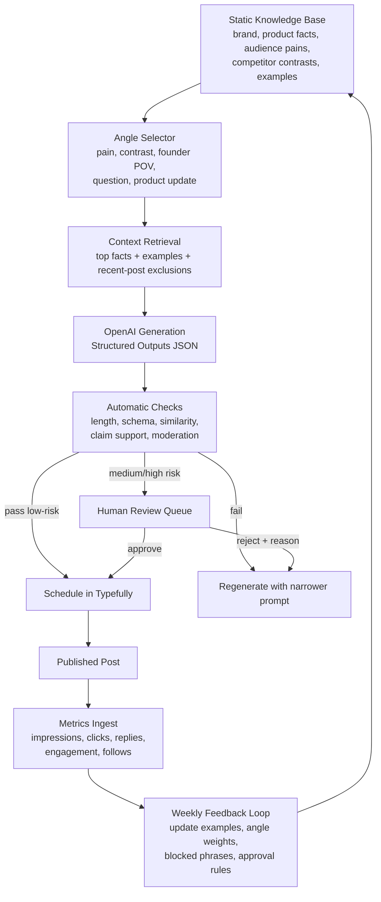

# Automating Business Social Accounts for ChaseDesk

## Executive summary

The production pattern that shows up again and again is not “LLM writes something and posts it immediately.” It is a scheduler-centered workflow: content is drafted into a calendar, routed through approvals, then measured with post-level analytics so the team can improve timing, format, and message fit. That pattern is visible in official product docs and case studies from urlBufferturn24view0, urlHootsuiteturn25view2, and urlSprout Socialturn9search2. citeturn11view8turn25view1turn11view13turn13view0turn13view2

The AI layer is usually positioned as a drafting, repurposing, and variation engine, not as an unchecked final publisher. urlBufferturn24view0 explicitly recommends reviewing and fact-checking AI output and says its assistant is most useful for variations and repurposing rather than writing from scratch; urlHootsuiteturn25view2’s OwlyWriter flow still routes content through editing, approval, and scheduling; and urlTypefullyturn7search1 has gone furthest toward agent-native workflows by adding comments, analytics, queue management, and agent integrations around drafts rather than replacing the editorial layer. citeturn16view0turn16view1turn16view3turn14view2turn14view0

For urlChaseDeskhttps://chasedesk.app, the best architecture is a static knowledge base plus selective refresh, not daily broad web scraping. urlOpenAIturn1search17’s file search is designed for stable internal knowledge bases, while web search is explicitly for fresh or unstable information; Structured Outputs, guardrails, moderation, and human review are the recommended control layers around generation. For a narrow category like receipt chasing for urlXerohttps://www.xero.com/ firms, that means: keep brand, product, competitor, tone, and proof points in a versioned KB; use web research only on triggers like pricing changes, product launches, or platform policy changes; generate drafts in a strict JSON schema; run automatic checks; then send only medium/high-risk drafts to human approval. citeturn15view6turn15view5turn15view1turn29view0turn29view1turn15view4

For publishing, the cleanest current fit is usually urlTypefullyturn7search1 if the primary channels are X, LinkedIn, and Threads and you want an AI-friendly workflow. Its API can create, edit, schedule, and publish drafts cross-platform; comments can now be read, written, and resolved via API; and queue plus analytics endpoints let an agent manage the calendar and learn from performance. Use urlBufferturn24view0 instead if you need broader SMB channel coverage. Move to direct network APIs only if you later need control that schedulers do not expose, because direct APIs add pricing, rate limits, permission scopes, and policy burden. citeturn11view1turn14view2turn14view1turn24view0turn18view0turn11view16turn23view2

## What production social automation looks like in the wild

The “social ops” pattern is mature and boring in the best possible way. In official examples, a UK fitness chain used urlHootsuiteturn25view2 to move from manual content approvals to governance for 100–250 posts per week, while monthly engagement and reach reports informed future content decisions. A dealership group using urlSprout Socialturn9search2 required approval and scheduling for local branch posts so distributed teams could publish while staying on-brand, compliant, and error-checked. On the SMB/agency side, a boutique agency managing 30+ channels with urlBufferturn24view0 relied on scheduling, approvals, and engagement tools, while another agency case study described a workflow where content is created in Buffer, reviewed by the client, and then sent automatically on schedule. A long-running retail case study from Buffer also shows the same content-calendar behavior: drafts, editors, multiple contributors, and consistent voice control. citeturn13view0turn13view2turn13view1turn13view5turn13view4

The AI pattern is also consistent across vendors: use it to accelerate ideation, generate variations, repurpose across platforms, and reduce writer’s block, but do not treat the raw output as final. Buffer’s documentation recommends double-checking suggestions, notes known limitations, and lets users regenerate, rephrase, shorten, or expand output. Buffer’s 2026 editorial guidance is even blunter: AI works best for variations and repurposing, while the writer still adds lived experience, specificity, and voice. Hootsuite’s OwlyWriter similarly starts with a prompt or keyword, generates options, then opens the output in Composer for editing, media, approval, and scheduling. citeturn16view0turn16view1turn16view3turn30view0

The most modern pattern is event-driven drafting plus agent-assisted review. urlMaketurn21view0 published a concrete recipe that watches a Slack release channel, asks AI whether an update is worthy of public sharing, writes a social caption, and can optionally insert a human approval step before publishing. urlTypefullyturn7search1 now supports a very similar model for social teams: agents can draft, refine, schedule, read and resolve draft comments, inspect the queue, and pull post analytics. That is the important architecture shift: the “AI” is no longer just a caption box; it sits inside a reviewable workflow with comments, queue state, and performance feedback. citeturn21view0turn14view0turn14view2turn14view1

## Recommended architecture for ChaseDesk

For ChaseDesk, the right content-source strategy is a static knowledge base as the primary context layer, with triggered freshness checks only when something actually changes. urlOpenAIturn1search17’s file search is built for retrieving from uploaded files and vector stores, while web search is meant for up-to-date information from the internet. That cleanly maps to this use case: brand positioning, product facts, audience pains, dos/don’ts, approved proof points, competitor contrasts, and good/bad examples all belong in a versioned KB; only time-sensitive inputs such as new competitor pricing, new platform rules, breaking category news, or newly published case studies should invoke web search. That is an inference from the tools’ intended uses, but it is the stable, lower-variance design for a narrow B2B category. citeturn15view6turn15view5turn27view6

Upstream from the publisher, there are three sensible orchestration choices. urlZapierturn21view2 emphasizes governance, retries, and audit trail infrastructure. urlMaketurn21view0 is strong for event-driven marketing automations and explicitly shows AI qualification plus optional approval before publish. urln8nturn21view3 is the best fit if you want self-hosting, visual debugging, and full control of AI workflows on your own stack. For ChaseDesk, the practical choice is either code plus a scheduler like GitHub Actions for simplicity, or n8n if you want an inspectable, self-hostable workflow graph. Publishing should still go through a dedicated social scheduler rather than direct API calls for the first version. citeturn21view2turn21view0turn21view3turn21view4



The important operational rule is simple: the model generates drafts, not truth. The truth comes from the KB and verified source snippets; the model’s job is packaging. urlTypefullyturn7search1 is particularly attractive here because it already supports agent integrations, comments on drafts, cross-platform publish, queue inspection, and post analytics in one workflow surface. citeturn11view1turn14view0turn14view2turn14view1

## Prompt and input design for ChaseDesk

The best-supported prompt patterns are very consistent across the source material: put instructions first, separate instructions from context, be explicit about desired style/length/format, provide examples, keep the output contract tight, and use Structured Outputs instead of asking politely for “JSON.” Buffer’s own AI prompt tips line up with that almost exactly: give the objective, target audience, core message, tone/style, CTA, platform, and any keywords or constraints. citeturn27view0turn27view1turn27view2turn27view3turn15view3turn16view0

A concise but production-ready ChaseDesk prompt should look like this:

```text
# Identity
You are ChaseDesk's social copywriter for X.

# Objective
Generate {n_candidates} candidate tweets for {campaign_goal}.
The audience is {audience_segment}.
The content angle is {content_angle}.

# Brand
Brand name: ChaseDesk
Tagline: We chase. You close.
Positioning: Receipt-chasing autopilot for Xero bookkeeping firms.
Primary audience: bookkeepers, firm owners, practice ops.
Desired reaction: feel understood, feel the pain clearly, become curious, maybe reply.

# Truth sources
Use only facts from:
<brand_facts>
{brand_facts}
</brand_facts>

<evidence_pool>
{evidence_pool}
</evidence_pool>

<competitor_context optional="true">
{competitor_context}
</competitor_context>

Never invent metrics, integrations, features, customer stories, or competitor claims.

# Style
- Plain English
- Founder-led, not corporate
- Specific, not generic AI hype
- One idea per tweet
- Short lines are okay
- Strong opening sentence
- No hashtags unless {allow_hashtags}=true
- No emojis unless {allow_emojis}=true
- No jargon unless it is normal for bookkeepers/Xero firms

# Hard constraints
- Platform: X
- Max characters: {char_limit}
- Avoid repeating phrasing from:
<recent_posts>
{recent_posts}
</recent_posts>
- Banned phrases:
<banned_phrases>
{banned_phrases}
</banned_phrases>
- If using a competitor, contrast categories; do not attack.
- If a factual claim appears, attach source_ids from the evidence pool.

# CTA policy
CTA mode: {cta_mode}
Allowed CTA examples: {allowed_ctas}
No CTA if cta_mode = none.

# Examples
<good_examples>
{good_examples}
</good_examples>

<bad_examples>
{bad_examples}
</bad_examples>

# Output contract
Return valid JSON only with this schema:
{
  "candidates": [
    {
      "tweet": "string",
      "angle": "string",
      "hook_type": "string",
      "character_count": 0,
      "source_ids": ["string"],
      "risk_flags": ["string"],
      "needs_human_review": false
    }
  ]
}
```

That structure is the one I would hand to engineering without apology. It follows urlOpenAI Structured Outputs guideturn1search1 guidance, uses the instruction-first pattern from urlOpenAI prompt engineering guidanceturn1search5, and mirrors the practical prompt ingredients recommended by urlBufferturn24view0 for social generation. citeturn15view1turn27view0turn27view1turn27view2turn16view0

The runtime variables I would require are these:

| Variable | Purpose | Example |
| --- | --- | --- |
| `campaign_goal` | What success means for this post | `awareness`, `replies`, `waitlist_soft_cta` |
| `audience_segment` | Who the post is for | `solo_bookkeeper`, `firm_owner_2_20_staff`, `practice_ops` |
| `content_angle` | The narrative frame | `pain_point`, `category_contrast`, `product_explainer`, `founder_observation`, `question` |
| `brand_facts` | Stable truth about ChaseDesk | Xero integration, no-login upload link, month-end chase flow |
| `evidence_pool` | Approved facts and proof | line-item product facts, sourced competitor notes, approved metrics |
| `competitor_context` | Optional contrast source | “Receipt tools help after upload; ChaseDesk helps get uploads to happen.” |
| `recent_posts` | Anti-duplication input | last 20–50 tweets or embeddings-nearest neighbors |
| `good_examples` / `bad_examples` | Few-shot steering | best-performing founder-style tweets and rejection examples |
| `banned_phrases` | Brand protection | “game changer”, “revolutionize accounting”, fake ROI claims |
| `cta_mode` | Controls conversion pressure | `none`, `soft_waitlist`, `reply_question` |
| `char_limit` | Network-specific hard cap | `240` or `260` |

### Sample prompt variant for a pain-led tweet

```text
Generate 3 X posts.

campaign_goal: awareness
audience_segment: firm_owner_2_20_staff
content_angle: pain_point
cta_mode: none
char_limit: 240

brand_facts:
- ChaseDesk detects missing receipts from Xero bank activity.
- ChaseDesk sends follow-ups automatically.
- Clients upload through a no-login link.
- ChaseDesk is built for bookkeeping firms.

evidence_pool:
- fact_1: Missing receipt chasing slows month-end close.
- fact_2: SMB clients avoid portals; simpler flows reduce friction.
- fact_3: ChaseDesk is Xero-first.

Write tweets that make the reader feel the operational pain of manual receipt chasing.
No hashtags. No emojis. No made-up numbers.
```

### Sample prompt variant for a competitor-contrast tweet

```text
Generate 3 X posts.

campaign_goal: awareness
audience_segment: solo_bookkeeper
content_angle: category_contrast
cta_mode: none
char_limit: 240

brand_facts:
- ChaseDesk focuses on collecting missing receipts before bookkeeping close.
- It is not a generic document cabinet.
- It is built for Xero bookkeeping firms.

competitor_context:
- Many receipt/document tools are strongest after a receipt has already arrived.
- ChaseDesk's wedge is getting missing receipts to show up in the first place.

Rules:
- Contrast the workflow category, not the competitor's quality.
- No insults. No “better than everyone” claims.
- No unsupported pricing or market claims.
```

### Sample prompt variant for a soft-CTA product tweet

```text
Generate 3 X posts.

campaign_goal: waitlist_soft_cta
audience_segment: practice_ops
content_angle: product_explainer
cta_mode: soft_waitlist
allowed_ctas:
- "If this is your workflow, we're opening access in batches."
- "If you're a Xero firm, join the waitlist."

brand_facts:
- ChaseDesk pulls Xero contacts and uncategorized bank activity.
- It detects what is missing.
- It chases clients on cadence.
- It extracts receipts and helps post clean entries.
- Clients do not need a login.

Style:
- Calm, operational, useful.
- Explain one workflow clearly.
- End with a soft CTA only if it reads naturally.
```

## Approval, quality filters, and regeneration

The control pattern that appears both in social tools and in urlOpenAIturn1search17 guidance is layered, not binary. Guardrails validate inputs, outputs, and tool actions automatically; human review pauses the workflow before sensitive actions; moderation handles obvious unsafe output; and approval workflows in the social scheduler handle brand/legal/editorial quality. citeturn29view0turn29view1turn29view2turn11view7turn12search0turn11view13

A good ChaseDesk approval matrix is this:

| Post type | Default route | Why |
| --- | --- | --- |
| Evergreen pain-point post | Auto-publish if all checks pass | Low factual risk; mostly positioning |
| Simple product-explainer post | Auto-publish if all claims map to KB facts | Deterministic product copy |
| Competitor-contrast post | Human review | Tone risk and easy-to-overstate differences |
| Posts with numbers, case-study claims, or comparisons | Human review | Proof risk |
| Newsjacking / trend response | Human review | Freshness risk; requires current facts |
| Reply automation or auto-engagement | Human review or disable entirely | Highest policy and brand risk |

The automatic filter stack should be deterministic first and model-based second. Deterministic checks catch schema validity, character count, duplicate phrasing, blocked words, banned phrases, required source IDs for factual claims, and channel-specific constraints. Then a model/guardrail layer can score for brand mismatch, unsupported claims, hallucination risk, and moderation issues. This matches urlOpenAIturn1search17’s output-guardrail guidance on syntax, moderation, and hallucination checks, plus what tools like urlSprout Socialturn9search2 are now doing with blocked words in approval workflows. citeturn29view3turn29view1turn19view0

The regeneration rules I would use are short and brutal:

1. **Schema fail** → regenerate once with the same angle and a stricter output contract.  
2. **Over character limit** → regenerate with “keep the same idea, remove examples and shorten by 20%.”  
3. **No source IDs on a factual claim** → regenerate with “remove unsupported claim or anchor it to provided fact IDs only.”  
4. **Genericness fail** → regenerate with “use one bookkeeping/Xero-specific detail; ban the phrases that caused failure.”  
5. **Similarity fail** → regenerate with a different hook type and exclude the nearest 5 historical posts.  
6. **Brand/tone fail** → regenerate with one good example and one bad example attached.  
7. **Still fails after 2 retries** → send to human review, don’t keep spinning tokens like a confused slot machine.

This regeneration approach is consistent with Buffer’s own regenerate/rephrase/shorten/expand controls and with urlOpenAIturn1search17’s eval guidance: collect failure cases, measure them, iterate on prompts and checks, and use production data to improve the system rather than guessing. citeturn16view0turn15view4

One caution that matters if you ever expand beyond scheduled posting into replies or engagement automation: urlX APIturn22search0’s developer guidelines explicitly emphasize user initiation, transparency, opt-out, real value, official API use, and compliance with rate limits. In plain English: scheduled organic posting is normal, but autonomous reply bots and engagement gimmicks are where accounts end up in the silly zone fast. citeturn23view3

## Scheduling and publishing tools

| Tool | Best fit | Strengths | Main trade-offs |
| --- | --- | --- | --- |
| urlTypefullyturn7search1 | X/LinkedIn/Threads-first, AI-native workflow | API can create, edit, schedule, publish, upload media, tag, and cross-post; supports comments via API; exposes queue management and post analytics; supports agent tooling and MCP-style integrations. citeturn11view1turn14view2turn14view1turn14view0 | Narrower channel footprint than broad schedulers; best when your core channels match its footprint. citeturn11view1turn26view0 |
| urlBufferturn24view0 | Broad SMB/cross-network scheduling with approvals | Wide channel coverage including LinkedIn, Threads, TikTok, YouTube, and X; clear post lifecycle docs; approval workflows; strong analytics and reporting; official Zapier support. citeturn24view0turn11view5turn11view7turn24view1turn11view6 | New developer API is still in beta; approval workflows sit on the higher-collaboration tier; AI assistant is useful but Buffer itself still recommends human review. citeturn24view0turn16view0 |
| urlHootsuiteturn25view2 | Governance-heavy team workflow | Strong planner, approvals, best-time-to-post, competitor benchmarking, analytics, listening, and large integration ecosystem; proven for high-volume governed publishing. citeturn25view2turn25view1turn12search0turn13view0 | Better suited to larger social ops than a lightweight founder-run publishing bot; public materials emphasize platform workflow and integrations more than an API-first build path. That last point is an inference from the currently surfaced docs. citeturn25view2turn25view3 |
| urlX APIturn22search0 | Maximum control on X | Direct post creation via `/2/tweets`; detailed public and private metrics; dedicated post analytics endpoint; flexible pay-per-use model. citeturn18view0turn23view0turn23view1turn11view16 | You inherit pricing, rate limits, and policy burden directly; create-with-URL is priced differently; private metrics have a 30-day limit; you must manage auth and compliance yourself. citeturn11view16turn23view2turn23view3turn23view0 |
| urlThreads APIturn2search3 | Direct first-party Threads publishing | Official support for text, image, video, and carousel posts; supports quote/repost behaviors; text attachments can run up to 10,000 characters with a link; intended to help creators and brands manage Threads presence at scale. citeturn2search3turn2search0turn2search18turn2search15turn2search22 | Requires a Meta app and the Threads use case setup; if you only need simple publishing, a scheduler is usually faster to operate. citeturn2search14turn2search4 |
| urlLinkedIn APIturn3search9 | Direct member/org publishing and analytics | Share on LinkedIn supports posting via the UGC API with `w_member_social`; LinkedIn is moving toward a newer Posts API; org analytics expose impressions, clicks, likes, comments, shares, engagement, and social metadata. citeturn17view5turn3search7turn17view7turn17view8 | Auth scopes and org permissions are more restrictive than scheduler use; org share stats are organic-only and limited to a rolling 12 months. citeturn17view5turn17view7 |

For ChaseDesk specifically, I would start with urlTypefullyturn7search1 as the publisher and use either code, urln8nturn21view3, or urlMaketurn21view0 upstream. If you later need Instagram/TikTok/YouTube or broader community management, move the same generation and approval engine behind urlBufferturn24view0 or urlHootsuiteturn25view2. citeturn14view0turn24view0turn25view2turn21view3turn21view0

## Static knowledge base schema and feedback loop

The metrics loop should normalize what your publisher exposes and what the native platforms expose. For X, that includes impressions, likes, replies, reposts, bookmarks, URL clicks, profile clicks, and engagements. LinkedIn org analytics include impressions, clicks, comments, likes, shares, unique impressions, and engagement. Typefully now exposes post analytics and queue data for X workflows; Buffer and Hootsuite expose cross-network post and channel reporting; and Sprout’s analytics guidance is explicit about reviewing performance weekly and broader shifts monthly or quarterly. citeturn23view0turn23view1turn17view7turn17view8turn14view1turn20view1turn25view1turn19view3

Use this as the canonical YAML schema; the exact same keys can be serialized to JSON:

```yaml
version: 1

brand:
  name: "ChaseDesk"
  website: "https://chasedesk.app"
  tagline: "We chase. You close."
  positioning: "Receipt-chasing autopilot for Xero bookkeeping firms"
  mission: "Reduce month-end friction by collecting missing receipts automatically"
  audience_segments:
    - id: "solo_bookkeeper"
      pains:
        - "manual receipt chasing"
        - "late client responses"
        - "Sunday-night close work"
      desired_outcomes:
        - "faster month-end close"
        - "less client follow-up"
    - id: "firm_owner_2_20_staff"
      pains:
        - "team time lost to admin"
        - "inconsistent close quality"
      desired_outcomes:
        - "better utilization"
        - "more capacity without hiring"

product_facts:
  - id: "pf_001"
    fact: "ChaseDesk connects to Xero and pulls contacts and uncategorized bank activity."
    evidence_type: "approved_internal"
    proof_url: "https://chasedesk.app"
  - id: "pf_002"
    fact: "Clients upload through a no-login link."
    evidence_type: "approved_internal"
    proof_url: "https://chasedesk.app"
  - id: "pf_003"
    fact: "The workflow targets missing receipts before month-end close."
    evidence_type: "approved_internal"
    proof_url: "https://chasedesk.app"

tone:
  primary: ["specific", "calm", "plain English", "founder-led", "operational"]
  avoid: ["generic AI hype", "broetry", "aggressive competitor attacks", "fake urgency"]
  banned_phrases:
    - "game changer"
    - "revolutionize accounting"
    - "10x your bookkeeping overnight"
    - "set and forget forever"

channels:
  x:
    char_limit: 240
    hashtags_allowed: false
    emoji_policy: "minimal"
    cta_modes: ["none", "soft_waitlist", "reply_question"]

content_pillars:
  - id: "pain_point"
    description: "Receipt chasing pain, month-end friction, client responsiveness"
  - id: "category_contrast"
    description: "Differentiate ChaseDesk from receipt capture/storage tools"
  - id: "product_explainer"
    description: "Explain one workflow clearly"
  - id: "founder_observation"
    description: "A sharp first-person insight from building/selling"
  - id: "question"
    description: "Invite replies from bookkeepers and practice owners"

competitors:
  - id: "dext"
    name: "Dext"
    category: "receipt capture / bookkeeping automation"
    positioning_summary: "automation after documents arrive"
    approved_contrast:
      - "Many tools help after the receipt arrives. ChaseDesk focuses on getting it to arrive."
    forbidden_attacks:
      - "outdated"
      - "useless"
    sources:
      - label: "official site or docs"
        url: "https://dext.com"
  - id: "hubdoc"
    name: "Hubdoc"
    category: "document collection and storage"
    positioning_summary: "document management tied to accounting workflow"
    approved_contrast:
      - "Storage is useful, but missing receipts still have to be collected."
    forbidden_attacks:
      - "inferior"
    sources:
      - label: "official site or docs"
        url: "https://www.hubdoc.com"

good_examples:
  - id: "gx_001"
    text: "Bookkeepers don’t lose Sunday nights because accounting is hard. They lose them because clients still haven’t sent the receipts."
    angle: "pain_point"
  - id: "gx_002"
    text: "Most receipt tools start too late. They help after the client sends the receipt."
    angle: "category_contrast"

bad_examples:
  - id: "bx_001"
    text: "AI is revolutionizing bookkeeping workflows for modern firms."
    rejection_reason: "generic"
  - id: "bx_002"
    text: "ChaseDesk saves 90% of your time instantly."
    rejection_reason: "unsupported_claim"

review_rules:
  human_review_if:
    - "competitor mentioned"
    - "numerical claim included"
    - "external news referenced"
    - "customer story referenced"
    - "new product claim not in product_facts"

performance_history:
  lookback_days: 90
  fields:
    - "impressions"
    - "engagements"
    - "engagement_rate"
    - "replies"
    - "reposts"
    - "url_clicks"
    - "profile_clicks"
    - "followers_gained"
    - "approval_outcome"
    - "rejection_reason"
    - "regen_count"

refresh_policy:
  static_review_every_days: 30
  trigger_web_research_on:
    - "competitor pricing change"
    - "competitor launch"
    - "platform policy update"
    - "major category news"
    - "new case study or benchmark"
```

The feedback loop should be just as structured as the prompt. urlOpenAIturn1search17 recommends defining eval objectives, collecting domain and production data, defining metrics, and comparing runs. For ChaseDesk, that means using approved and rejected drafts, plus published winners and losers, as the eval set; scoring drafts for pass rate, approval rate, duplication, unsupported-claim rate, and downstream engagement; and updating examples, angle weights, and blocked phrases weekly. Sprout’s analytics guidance to check performance weekly and review broader trends monthly is the right operating cadence here too. citeturn15view4turn19view3

A practical weekly loop is:

1. Pull post metrics from the publisher and native APIs where available.  
2. Normalize by platform and goal.  
3. Rank top and bottom quartile posts by angle and hook type.  
4. Add 3–5 winners to `good_examples`; add repeated failure patterns to `bad_examples` or `banned_phrases`.  
5. Review every human rejection reason; if the same reason appears more than twice, turn it into an automatic check.  
6. Refresh competitor/news facts only if a trigger fired.

That is the boring, durable setup. Which, in social automation, is exactly what you want.